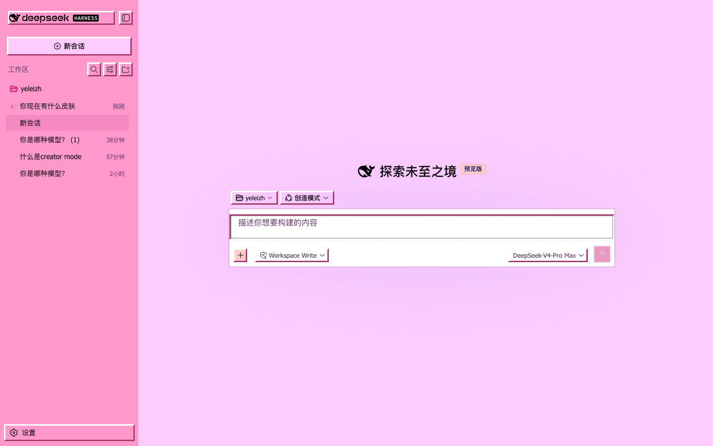
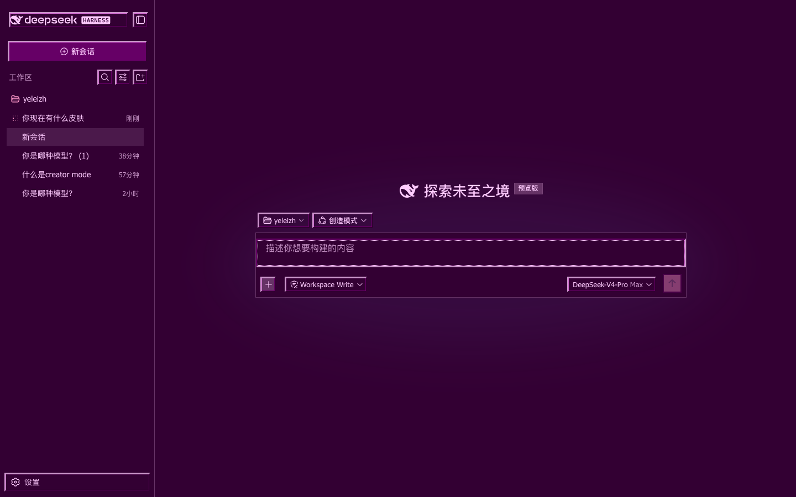

# kawaii 2000s · dsh skin

[中文版本](./README.zh.md)

A skin for the DeepSeek Harness web UI: candy pink + baby blue, all the 2000s vibes.

## Screenshots

Light | Dark
---|---
 | 

## Install

Three steps:

**1.** Add a line to `dependencies` in `~/.dsh/profiles/web/package.json`:

```json
"dsh-skin-kawaii2000": "github:shunkwon/dsh-skin-kawaii2000"
```

**2.** Add a block to `~/.dsh/profiles/web/cordis.patch.yml`:

```yaml
- insert:
    - id: skin-kawaii2000
      name: dsh-skin-kawaii2000
```

**3.** Install and restart dsh:

```bash
cd ~/.dsh/profiles/web
pnpm install
```

Done — open http://127.0.0.1:3080 and enjoy the pink ✨

### Want to disable it?

Add `disabled: true` to that patch line and restart, or remove both additions above.

## License

[MIT](./LICENSE)
